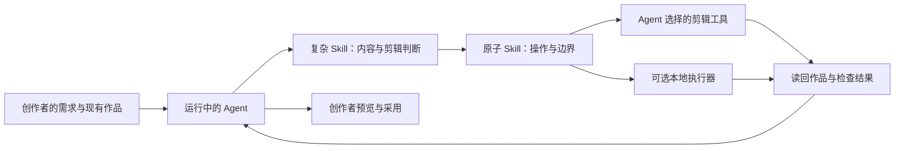

# Editing Skill Library · 剪辑 Skill 库

**让剪辑 Agent 按创作意图工作，并把每次修改的范围、依据和结果讲清楚。**

面向剪辑 Agent 开发者的通用 Skill 库。把素材分析、内容取舍、剪辑方案和局部修改组织成可读的操作协议，供运行中的 Agent 结合自己的剪辑工具执行；附带一个可选的 Python 本地执行器与 MCP 桥接入口。

**当前为实验性源码预览。** Skill 定义和部分执行路径已实现，完整用户链、创作效果与真实编辑器安装仍在验证。先读下面的使用入口与[开发状态](docs/development-status.md)，再决定接入范围。

本项目沿用原 `douyin-film-recap` 仓库与版本历史。原 v0.2.0 影视解说 Skill 已并入[影视解说子集](workflows/raven-film-recap/douyin-film-recap/README.md)，通用库成为当前顶层入口。原 Python 包仍为 0.2.0；仓库源码预览版本为 `v0.3.0-alpha.1`。

## 从一句剪辑需求，到可检查的修改

常见需求并不只是“剪短一点”：

- “去掉这段口误，保留完整观点和自然停顿。”
- “这段教程操作讲得太快，补足关键步骤，别改变操作顺序。”
- “只改这句字幕，保留我刚调好的位置和其他片段。”

本库把这些需求拆成三件事：复杂 Skill 判断如何剪；原子 Skill 描述明确操作和约束；执行后读回作品，区分候选结果、实际采用与最终交付。上面的句子是使用场景示例，不是已完成案例。



## 库里有什么

| 层次 | 内容 | 用途 |
|---|---|---|
| 原子 Skill | 34 项操作定义 | 测量、转写、字幕、时间线、音频与交付等明确任务 |
| 复杂 Skill | 16 条工作流 | 口播、教程、解说等场景中的选段、结构与表达判断 |
| 风格参考 | 实验性风格卡与索引 | 辅助选择和比较表达方式；效果尚未全面验证 |
| 合同与路由 | 输入、保护范围、版本、证据与交接约定 | 帮助 Agent 选择能力，并保留不能确定的部分 |
| 可选执行层 | 本地 Python runtime、MCP 桥接、1 个 Agent 适配入口 | 为已有操作提供可检查的本地执行路径 |

34 + 16 + 1 是注册条目数，不能解释为 51 项能力已全部验收。目录和条目见 [registry/skills.json](registry/skills.json)。

本次迁移后，影视解说子集的 80 项原回归全部通过，通用库结构与 MCP 读取检查通过；它们不替代实际剪辑效果验证。详见[发布检查范围](docs/verification-v0.3.md)。

## 两种接入方式

### 直接让 Agent 读取 Skill

从 [Skill 入口](skills/editing-skill-library/SKILL.md)开始，再读取[语义路由](registry/router.md)与匹配的 Skill。Agent 按[能力交接合同](contracts/capability-handoff.md)，选择它已经能调用的 MCP、CLI、编辑器插件或媒体工具。

Skill 层不要求指定生成模型或 Provider。模型调用、费用、凭据和工具连接由运行中的 Agent 管理。ChatCut、剪映或自己的剪辑 Agent 都属于适配目标；当前仓库不承诺这些编辑器已经接通或完成兼容验收。

### 试用可选的本地执行层

先取得仓库，再执行只读检查：

```bash
git clone https://github.com/dengxianghua888-ops/douyin-film-recap.git
cd douyin-film-recap
```

在仓库根目录执行：

```bash
python3 scripts/verify_library.py structure
python3 scripts/install_doctor.py --root "$PWD"
```

第一条检查目录结构、注册关系与本地链接；第二条报告当前机器的依赖。检查通过不等于作品效果通过，缺少某个本地依赖也不代表 Agent 无法调用其他等价工具。

需要 MCP 时，可把 `python3 /absolute/path/to/editing-skill-library/scripts/mcp_server.py` 配置为客户端的 stdio 服务。桥接提供 `list_skills`、`diagnose_installation`、`run_operation`。实际执行还要设置独占的 `EDITING_SKILL_WORK_ROOT`；读取与列举 Skill 无须 API Key。详见[本地接入说明](docs/local-setup.md)。

## 这轮源码主要改进

- 音视频使用共同来源时间基准；增加长音频处理与中断回收的技术验证。
- 区分普通内容保护与严格来源／PCM 冻结，避免用一个“保护”词覆盖不同承诺。
- 改善候选、采用和作品版本检查，减少局部修改覆盖用户已有状态的风险。
- 调整宿主、Provider 与依赖边界，让通用 Skill 和可选本地实现各自承担明确职责。

当前源码仍有已知边界，尤其是部分输入的帧时长、严格音频 helper 的可迁移安装，以及真人修改后的完整作品链。详见[开发状态](docs/development-status.md)。

## 目录导航

`atomic/` 原子 Skill · `workflows/` 场景工作流 · `styles/` 风格参考 · `contracts/` 交接协议 · `runtime/` 可选执行器 · `registry/` 路由与注册 · `provenance/` 来源记录

历史评测中的原视频、音频、模型、字体、内部调度记录与本机二进制均不随仓库提供。部分历史证据链接转向[证据范围说明](docs/evidence-scope.md)，不应理解为公共仓库已提供完整复现材料。

## 原影视解说用户迁移

原安装与运行流程收在 `workflows/raven-film-recap/douyin-film-recap/`，先进入该目录再运行 `pip install`、安装脚本或原 CLI。该子集仍按原 MIT 许可提供；其 Storyboard 流水线与通用 WorkDocument 执行器并非相同协议，不会自动互换已有工程。详见[迁移说明](docs/migration-v0.3.md)。

## 使用与参与

先用一段有权使用的素材验证一个明确任务，保留原作品；记录实际请求、版本、结果和未满足的条件。欢迎通过 Issue 提交最小可复现问题或适配观察，避免上传凭据和未获授权的素材。

本仓库目前没有统一的软件授权许可。部分参考和改写材料带有独立条件，含 CC BY-NC 与 CC BY-SA；公开可读不等于整库可任意商用。使用前请读[许可与来源说明](LICENSES.md)。

如果这套拆解方法对你有用，可以 Star 收藏；关注后续版本可选择 Watch → Releases。
